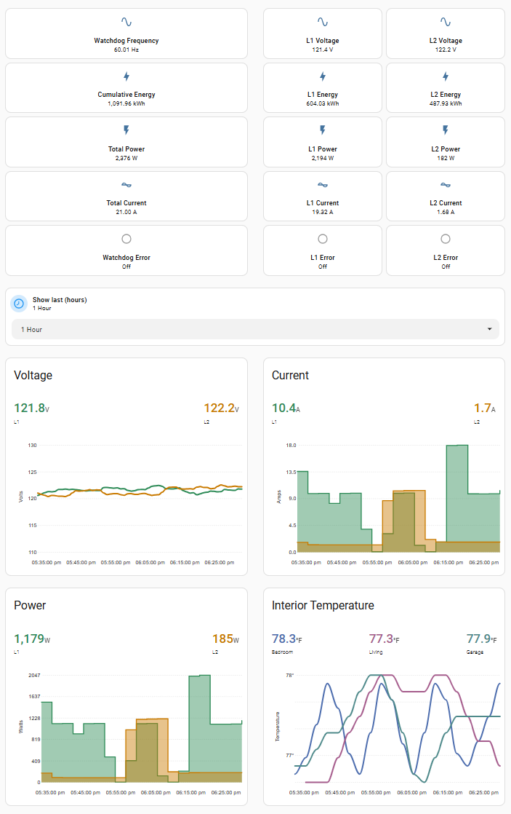

# Power Watchdog WiFi for Home Assistant

Experimental, read-only custom integration for Hughes Autoformers Power Watchdog WiFi models.

## Quick add to HACS

## Safety boundary

The client implements only:

- account login
- device listing
- WebSocket login
- WebSocket subscription
- telemetry decoding

It does not implement relay control, energy reset, configuration, rename, add, delete, share, transfer, or a generic request/command method.

## Installation (recommended: HACS)

### Option A: HACS (automatic update discovery)

1. Install HACS in Home Assistant if not already installed.
2. In HACS, open the menu **⋮ > Custom repositories**.
3. Add repository URL: `https://github.com/karlknoernschild/home-assistant-watchdog` with category/type **Integration**.
4. Search for **Power Watchdog WiFi** in HACS and click **Download**.
5. Restart Home Assistant.
6. Open **Settings > Devices & services > Add integration**.
7. Search for **Power Watchdog WiFi** and complete setup.

After download, HACS will detect new tagged releases and surface updates in the HACS UI.

### Option B: Manual copy

1. Copy `custom_components/power_watchdog_wifi` into: `/config/custom_components/power_watchdog_wifi`
2. Restart Home Assistant.
3. Add integration from **Settings > Devices & services**.

## Entities

- L1/L2 voltage
- L1/L2 current
- Total current (sum of both legs)
- L1/L2 power
- Total power
- L1/L2 accumulated energy
- Total accumulated energy
- Frequency
- L1 error present
- L2 error present
- Error present (aggregate)
- Derived rolling average power (5-minute window)
- Derived today energy (daily delta from total energy)
- Derived yesterday energy (previous local-day bucket)

## Example dashboard

An optional, sanitized example dashboard is available in
[`examples/dashboard`](examples/dashboard).

It includes voltage, current, power, energy, frequency, and error-state cards
using only entities supplied by this integration. Private device names and
installation-specific environmental sensors are not included.

The example requires these HACS frontend cards:

- Config Template Card
- ApexCharts Card
- card-mod

See [`examples/dashboard/README.md`](examples/dashboard/README.md) for helper
setup, entity-prefix replacement, and import instructions.

## Diagnostics

Diagnostics are available from Home Assistant and include coordinator runtime counters, protocol markers, and normalized device metadata with recursive redaction for sensitive account, token, and device identifier fields.

Native today/yesterday/peak-demand energy fields are not currently provided by the decoded protocol path, so those metrics are exposed as derived values. Derived daily buckets roll at the local day boundary and are persisted across restart.

## Data path

This is a cloud-push integration. It authenticates against `api.watchdogsrv.com` and receives telemetry from `ws.watchdogsrv.com:5521`.

## Notes

- Credentials are stored in the Home Assistant config entry so the integration can reconnect after restarts.
- The WebSocket endpoint currently uses `ws://`, matching the official app.
- This is an independently developed interoperability integration and is not affiliated with Hughes Autoformers.

## Development quality tooling

- License: `LICENSE` (MIT).
- Test/lint/dev tooling dependencies: `requirements_test.txt`.
- Pre-commit: `.pre-commit-config.yaml` (`python -m pre_commit run --all-files`).
- Pytest harness is strict by default (`pytest.ini`) and blocks outbound network access during tests except localhost.
