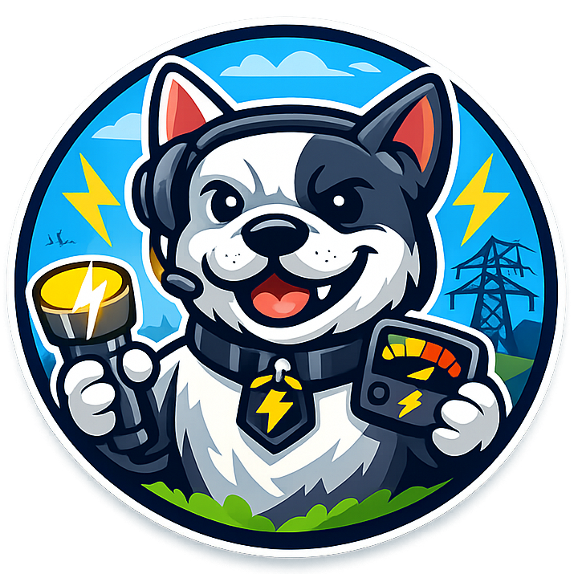

#  Power Watchdog WiFi for Home Assistant

Experimental, read-only custom integration for Hughes Autoformers Power Watchdog WiFi models.

## Quick add to HACS

## Safety boundary

The client implements only:

- account login
- device listing
- WebSocket login
- WebSocket subscription
- telemetry decoding

It does not implement relay control, energy reset, configuration, rename, add, delete, share, transfer, or a generic request/command method.

## Installation (recommended: HACS)

### Option A: HACS (automatic update discovery)

1. Install HACS in Home Assistant if not already installed.
2. In HACS, open the menu **⋮ > Custom repositories**.
3. Add repository URL: `https://github.com/karlknoernschild/home-assistant-watchdog` with category/type **Integration**.
4. Search for **Power Watchdog WiFi** in HACS and click **Download**.
5. Restart Home Assistant.
6. Open **Settings > Devices & services > Add integration**.
7. Search for **Power Watchdog WiFi** and complete setup.
8. If your account has multiple Watchdog devices, repeat **Add integration** once per device.

After download, HACS will detect new tagged releases and surface updates in the HACS UI.

### Option B: Manual copy

1. Copy `custom_components/power_watchdog_wifi` into: `/config/custom_components/power_watchdog_wifi`
2. Restart Home Assistant.
3. Add integration from **Settings > Devices & services**.

## Entities

- L1/L2 voltage
- L1/L2 current
- Total current (sum of both legs)
- L1/L2 power
- Total power
- L1/L2 accumulated energy
- Total accumulated energy
- Frequency
- L1 error present
- L2 error present
- Error present (aggregate)
- Derived rolling average power (5-minute window)
- Derived today energy (daily delta from total energy)
- Derived yesterday energy (previous local-day bucket)

Derived metrics behavior:

- Daily buckets roll at the local day boundary (today resets, yesterday receives the prior day value).
- Derived day-bucket energy is persisted and restored across Home Assistant restart.
- Rolling average power is computed from runtime samples and resumes from new samples after restart.

Availability behavior:

- In **Always on** mode, entities become unavailable when no valid telemetry is received for 120 seconds.
- In **Polling** mode, availability timeout is extended to avoid flapping between poll cycles.
- Availability is restored automatically when valid telemetry resumes.

## Connection modes

The integration supports two runtime connection modes (set in integration **Configure** options):

- **Polling** (default): open a short-lived WebSocket session every _n_ minutes, ingest telemetry, then disconnect.
- **Always on**: maintain a persistent WebSocket telemetry subscription.

Why choose **Polling**:

- Reduces 24/7 persistent cloud connections from always-running Home Assistant servers.
- Better matches users who only need periodic updates for dashboards and trend views.
- Lowers aggregate concurrent connection pressure as adoption grows.
- Uses bounded jitter to spread reconnect timing and reduce synchronized bursts.

Why choose **Always on**:

- Best for near real-time automations and alerting.
- Produces the most complete high-resolution history.
- Minimizes freshness delay between cloud updates and Home Assistant state.

Tradeoffs to consider:

- **Polling** reduces connection time but can miss short-lived events between polls.
- **Always on** gives best responsiveness but keeps a continuous cloud session active.
- If you are concerned about provider-side connection load or long-lived sessions,
  prefer **Polling** with a moderate interval (default: 10 minutes).

Polling interval choices are:

- 1 minute
- 2 minutes
- 5 minutes
- 10 minutes
- 15 minutes
- 30 minutes
- 60 minutes

Default polling interval is **10 minutes**. Polling mode also uses bounded jitter to spread reconnect timing across installations.

## Logging

This integration includes structured runtime logs for setup, authentication, WebSocket lifecycle, polling cycles, availability transitions, metadata refresh, and diagnostics-related counters.

To enable debug logging, use Home Assistant's built-in logger configuration. The simplest approach is the **Enable debug logging** button in the integration's diagnostic download dialog. Use debug logging temporarily when troubleshooting connection or authentication issues, then remove the override to return to normal log volume.

## Example dashboard

An optional, sanitized example dashboard is available in [`examples/dashboard`](examples/dashboard).

It includes voltage, current, power, energy, frequency, and error-state cards using only entities supplied by this integration. Private device names and installation-specific environmental sensors are not included.

The example requires these HACS frontend cards:

- Config Template Card
- ApexCharts Card
- card-mod

The example also requires an Input select helper with entity ID `input_select.graph_time_range` and these exact options:

- 1 Hour
- 3 Hours
- 6 Hours
- 12 Hours
- 24 Hours
- 3 Days
- 7 Days

You can create this helper in the UI or merge [`examples/dashboard/helpers.yaml`](examples/dashboard/helpers.yaml) into `configuration.yaml`.

See [`examples/dashboard/README.md`](examples/dashboard/README.md) for helper setup, entity-prefix replacement, and import instructions.

## Diagnostics

Diagnostics are available from Home Assistant and include coordinator runtime counters, protocol markers, and normalized device metadata with recursive redaction for sensitive account, token, and device identifier fields.

Native today/yesterday/peak-demand energy fields are not currently provided by the decoded protocol path, so those metrics are exposed as derived values. Derived daily buckets roll at the local day boundary and are persisted across restart.

When runtime failures occur, the integration creates Home Assistant Repairs issues for authentication failures, cloud connectivity failures, and unsupported device mapping.

## Data path

This integration authenticates against `api.watchdogsrv.com` and receives telemetry from `ws.watchdogsrv.com:5521` using WebSocket sessions. Depending on connection mode, those sessions are either persistent (**Always on**) or short-lived at a configurable interval (**Polling**).

## Notes

- Credentials are stored in the Home Assistant config entry so the integration can reconnect after restarts.
- The WebSocket endpoint currently uses `ws://`, matching the official app.
- This is an independently developed interoperability integration and is not affiliated with Hughes Autoformers.

## Development quality tooling

- License: `LICENSE` (MIT).
- Test/lint/dev tooling dependencies: `requirements_test.txt`.
- Pre-commit: `.pre-commit-config.yaml` (`python -m pre_commit run --all-files`).
- Pytest harness is strict by default (`pytest.ini`) and blocks outbound network access during tests except localhost.
